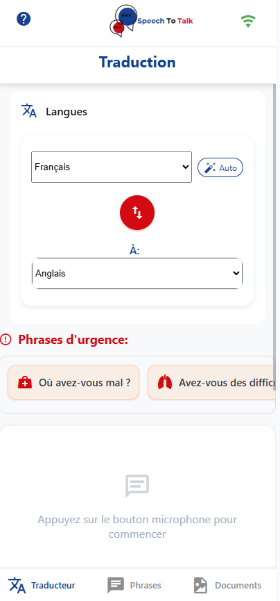
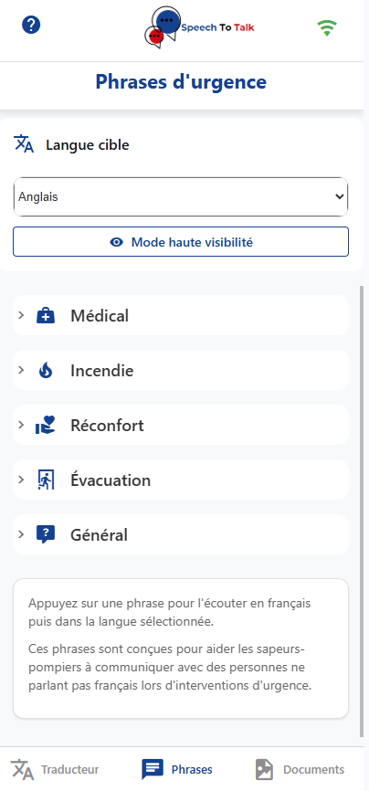
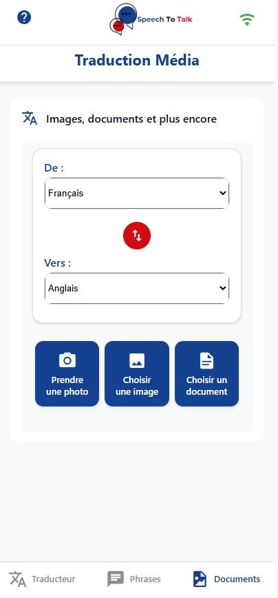

# SpeechToTalk 

<div align="center">
  
</div>

## À propos de l'application

SpeechToTalk est une application mobile de traduction vocale en temps réel conçue spécifiquement pour les **sapeurs-pompiers** qui sont au contact de personnes ne parlant pas français. L'application utilise la reconnaissance vocale pour capturer la parole, la traduit dans la langue cible, et peut même prononcer la traduction à haute voix. Grâce à son système de cache, elle peut fonctionner hors ligne dans des situations d'urgence.

## Fonctionnalités principales

- **Traduction vocale en temps réel** : Parlez dans votre langue et obtenez une traduction instantanée
- **Détection automatique de langue** : Identification automatique de la langue parlée pour une communication plus rapide en situation d'urgence
- **Interface utilisateur intuitive** : Design moderne et cohérent avec des composants réutilisables
- **Phrases d'urgence prédéfinies** : Accès rapide à des phrases essentielles pour les situations d'urgence médicales
- **Traduction de médias** : Possibilité de traduire du texte à partir d'images et de documents
- **Système de cache avancé** : Stockage intelligent des traductions pour une utilisation hors ligne
- **Mode hors ligne** : Utilisez l'application même sans connexion internet (pour les langues téléchargées)
- **Support multi-langues** : Traduction entre plus de 15 langues
- **Mode haute visibilité** : Interface adaptée pour une utilisation dans des conditions difficiles

## Installation

1. Clonez ce dépôt

   ```bash
   git clone https://github.com/votre-nom/SpeechToTalk.git
   cd SpeechToTalk
   ```

2. Installez les dépendances

   ```bash
   npm install
   ```

3. Configurez les APIs de traduction

   L'application utilise les APIs Google Cloud pour la traduction, la reconnaissance de texte dans les images et la détection automatique de langue. Vous devez configurer vos propres clés API :

   - Copiez le fichier `.env.example` en `.env` à la racine du projet :

   ```bash
   cp .env.example .env
   ```

   - Modifiez le fichier `.env` pour ajouter votre clé API Google Cloud :

   ```
   GOOGLE_CLOUD_API_KEY=VOTRE_CLE_API_GOOGLE_CLOUD
   ```

   - Pour obtenir une clé API Google Cloud :
     1. Créez un projet sur [Google Cloud Console](https://console.cloud.google.com/)
     2. Activez les APIs Cloud Translation, Cloud Vision et Cloud Speech-to-Text
     3. Créez une clé API et copiez-la dans le fichier `.env`
     4. Assurez-vous de ne jamais partager ou committer ce fichier dans Git

4. Démarrez l'application

   ```bash
   npx expo start
   ```

## Technologies utilisées

- **React Native** : Framework pour le développement d'applications mobiles
- **Expo** : Plateforme pour simplifier le développement React Native
- **React Navigation** : Navigation entre les écrans
- **@react-native-voice/voice** : Reconnaissance vocale
- **react-native-tts** : Synthèse vocale (Text-to-Speech)
- **@react-native-picker/picker** : Sélection des langues
- **@expo/vector-icons** : Icônes pour l'interface utilisateur
- **AsyncStorage** : Persistance des données pour le cache de traduction
- **NetInfo** : Détection de la connectivité réseau
- **expo-document-picker** et **expo-image-picker** : Sélection de documents et d'images pour la traduction

## Structure du projet

- **/app** : Code source principal de l'application
  - **/app/(tabs)** : Écrans principaux de l'application (Traducteur, Phrases, Documents)
  - **/app/feedback.tsx** : Écran de feedback et paramètres
- **/components** : Composants réutilisables
  - **/components/ui** : Composants UI réutilisables (AppButton, AppCard, AppHeader)
  - **/components** : Autres composants (MediaTranslator, StorageOptimizationPanel, etc.)
- **/constants** : Constantes de l'application (Colors, Theme)
- **/services** : Services de l'application
  - **/services/translationService.ts** : Gestion des traductions et du cache
  - **/services/compressionService.ts** : Optimisation du stockage des traductions
- **/assets** : Images, polices et autres ressources

## Configuration et utilisation des APIs

### APIs de traduction

L'application utilise principalement trois APIs Google Cloud :

1. **Google Cloud Translation API** : Pour la traduction de texte entre différentes langues
2. **Google Cloud Vision API** : Pour la reconnaissance de texte dans les images
3. **Google Cloud Speech-to-Text API** : Pour la détection automatique de la langue parlée

### Système de cache intelligent

Pour optimiser l'utilisation des APIs et permettre un fonctionnement hors ligne, SpeechToTalk implémente un système de cache sophistiqué :

- **Mise en cache des traductions** : Les traductions fréquentes sont stockées localement
- **Téléchargement de langues** : Possibilité de télécharger des ensembles de traductions pour une langue spécifique
- **Optimisation du stockage** : Compression des données pour réduire l'espace utilisé
- **Nettoyage automatique** : Suppression des traductions les moins utilisées lorsque la limite de cache est atteinte

### Sécurité des clés API

Les clés API Google Cloud donnent accès à des services payants et doivent être protégées. SpeechToTalk implémente les bonnes pratiques suivantes :

- **Variables d'environnement** : Les clés API sont stockées dans un fichier `.env` qui n'est pas partagé sur Git
- **Fichier d'exemple** : Un fichier `.env.example` est fourni comme modèle sans clés réelles
- **Vérification d'intégrité** : L'application vérifie que les clés sont bien définies au démarrage

Pour sécuriser vos clés API :

- Ne commettez jamais le fichier `.env` dans Git
- Limitez les API activées pour chaque clé dans la console Google Cloud
- Utilisez des restrictions d'API (domaines, adresses IP) quand c'est possible
- Surveillez régulièrement l'utilisation de vos clés API

### Gestion des quotas d'API

Les APIs Google Cloud sont soumises à des quotas. Pour éviter de dépasser ces limites :

- Utilisez le système de cache autant que possible
- Téléchargez les langues fréquemment utilisées
- Considérez l'utilisation d'un compte Google Cloud payant pour des quotas plus élevés en production

## Captures d'écran

<div align="center">
  
  
  
</div>

*De gauche à droite: Écran principal de traduction, Sélection des langues avec détection automatique, Traduction de médias*

## Contribution

Les contributions sont les bienvenues ! N'hésitez pas à ouvrir une issue ou à soumettre une pull request.

## Licence

Ce projet est sous licence MIT. Voir le fichier LICENSE pour plus de détails.

## Améliorations futures

- Un mode **conversation** où chaque utilisateur peut parler à tour de rôle, avec détection automatique de la langue source.

## Améliorations récentes

### Version 2.2.0 (Mai 2025)

- **Détection automatique de langue** : Ajout d'une fonctionnalité permettant de détecter automatiquement la langue parlée grâce à l'API Google Cloud Speech-to-Text
- **Interface de sélection de langue améliorée** : Ajout d'un bouton "Auto" pour activer/désactiver la détection automatique
- **Sécurisation des clés API** : Mise en place d'un système de variables d'environnement pour protéger les clés API
- **Optimisation des performances** : Amélioration de la réactivité lors de la détection et traduction en temps réel
- **Corrections de bugs** : Résolution de problèmes d'interface et de styles dupliqués

### Version 2.1.0 (Avril 2025)

- **Simplification de la barre de navigation** : Réduction à trois onglets principaux (Traducteur, Phrases, Documents) pour une expérience utilisateur plus fluide
- **Refonte des paramètres** : Intégration des paramètres dans l'écran de feedback pour une meilleure organisation
- **Mise à jour de la palette de couleurs** : Adoption d'une nouvelle teinte bleue (#144291) pour une meilleure identité visuelle
- **Optimisation du code** : Élimination des duplications de code et simplification de l'architecture

### Version 2.0.0 (Avril 2025)

- **Refonte de l'interface utilisateur** : Implémentation de composants UI réutilisables pour une meilleure cohérence visuelle
- **Nouveau module de traduction de médias** : Ajout de la possibilité de traduire du texte à partir d'images et de documents
- **Optimisation du système de cache** : Amélioration des performances et réduction de l'utilisation de la mémoire
- **Mode haute visibilité** : Ajout d'un mode d'affichage optimisé pour les conditions difficiles
- **Corrections de bugs** : Résolution de divers problèmes d'encodage et d'affichage

## Auteur

XRWeb